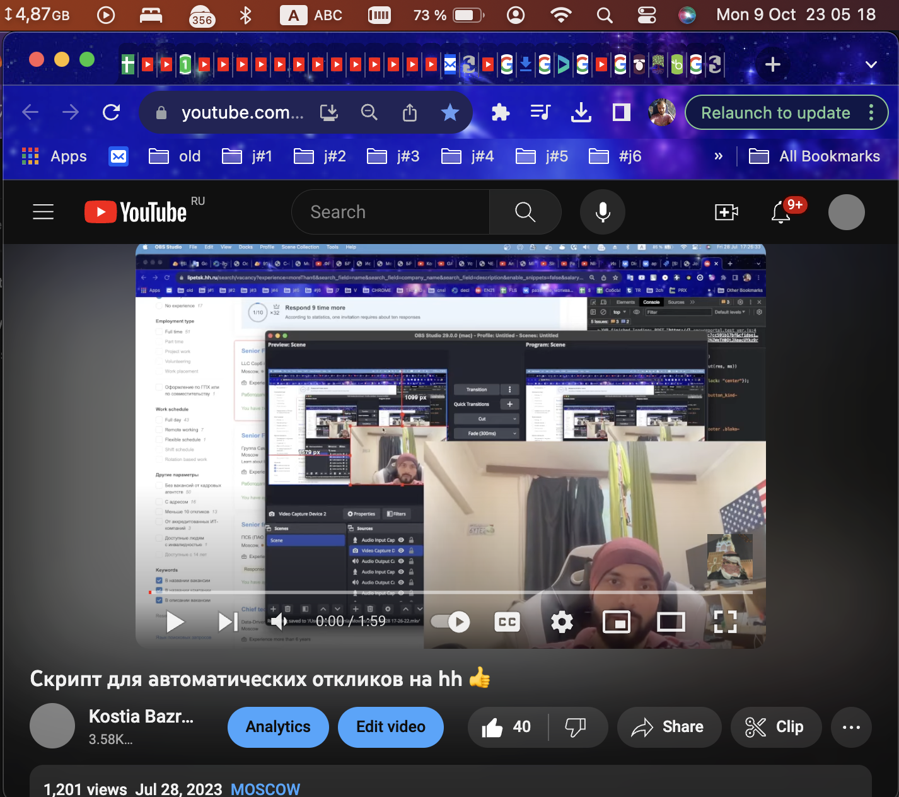

# Скрипт для автоматических откликов на hh

### Мануал:

- открываем <a target="_blank" href="https://lipetsk.hh.ru/search/vacancy?experience=between3And6&search_field=name&enable_snippets=false&text=vue+not+python+not+php+not+qa+not+.net+not+node+not+%D1%81%D1%82%D0%B0%D0%B6%D0%B5%D1%80+not+fullstack+not+backend&ored_clusters=true&L_save_area=true">страницу поиска hh</a>
- настраиваем под нужные нам фильтры
- Открываем консоль 
- вставляем <a target="_blank" href="./hh.ru-bot.js">код</a>
- жмем ентер .

- если надоело каждый раз искать скрипт, то добавь в закладки <a href="./bookmark.min.js">этот скрипт</a>. Учти, что скрипт должен начинаться с `javascrit:` (хром любит его удалять при вставке, руками пиши!).

# TODO 
- сделать расширением Хрома
- добавить автоподнятия https://chromewebstore.google.com/detail/hhru-resumes-updater/ljbjhmajkmjknjifacdcheegakmhpfca
- добавить платный функционал - перенос всего на сервак
- мультиаккинг